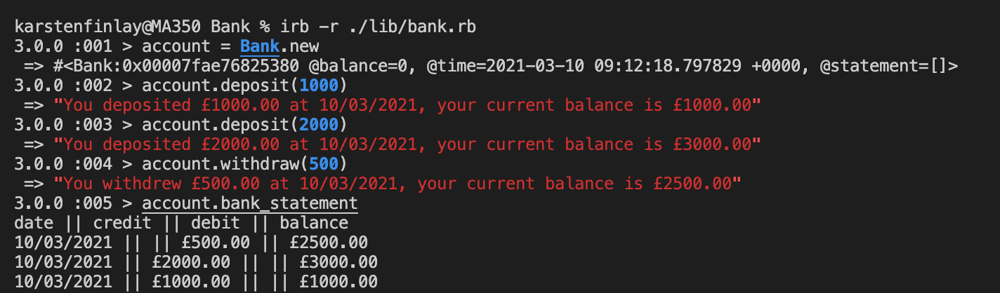

# Bank_tech_test

Simple app that allows the user to deposit money, withdraw money and can print out a bankstatement to an account, used in irb.

## User stories

```
As a customer
So that I can spend money
I want to be able to withdraw a sum of cash.
```

```
As a customer
So that I save money
I want to be able to deposit a sum of cash.
```

```
As a customer
So that I can't spend money I don't have
I want a warning that tells me I can't withdraw money I don't have.
```

```
As a customer
So that I can see how much money I am spending/saving.
I want to be able to see a list of my withdraws and deposits.
```

## How to use Bank_tech_test:

Fork this repo, and then ```git clone``` the repo.

run

```
bundle install
```

Then really simple, just use this line of code:

```
irb -r ./lib/bank.rb
```
Commands that you can use:

```
withdraw(NUMBER)
```
```
deposit(NUMBER)
```
```
bank_statement()
```

## Approach

I went for a fairly simplistic approach. I went for one class, as I didn't think there would be need for two classes. I used a TDD approach, followed by a RG (Red-Green), checking the test fails, then getting it to pass. One thing I should have been doing throughout the process is refactoring, which is something I forgot. Further down the line I think I should have split the classes, but am still fairly unsure about this.

## Acceptance criteria

Client makes a deposit of 1000 on 10-01-2012  
She then deposits of 2000 on 13-01-2012  
And makes a withdrawal of 500 on 14-01-2012  
When she prints her bank statement  
She would see:

```
date || credit || debit || balance
14/01/2012 || || 500.00 || 2500.00
13/01/2012 || 2000.00 || || 3000.00
10/01/2012 || 1000.00 || || 1000.00
```

## Solution

Run the following commands in IRB:  
```
> bank = Bank.new 
> bank.deposit(1000)
> bank.deposit(2000)  
> bank.withdraw(500)  
> bank.bank_statement
```



## Things I need to improve:

I didn't refactor early enough, this has left me with one class that does everything, which is not very neat. It gets the job done, but is very inefficient. 

I also need to plan much more before diving straight into it, as seen by my commit history, user stories were added far too late.

I don't think my tests were very good as well, while always having 100% coverage, I think that my tests weren't testing behaviour which is a problem.

I also need to get in the swing of making my Readmes earlier on, rather than leaving them to the end. 
